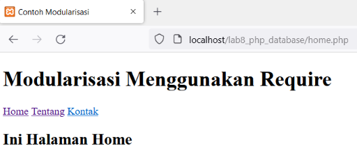
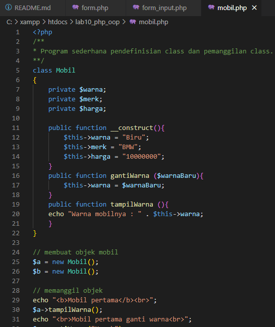
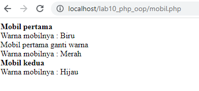
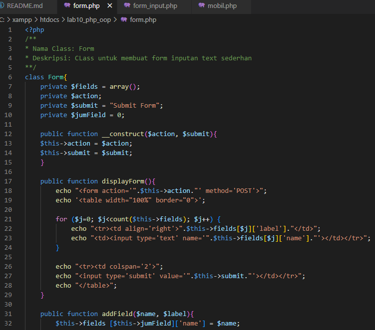
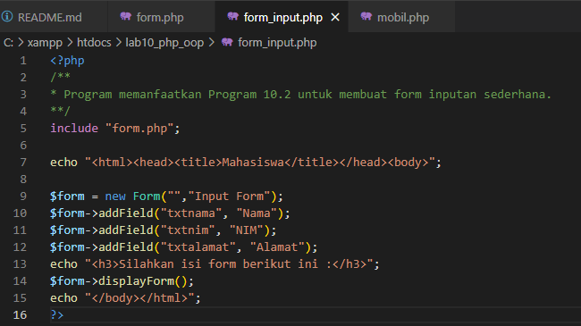
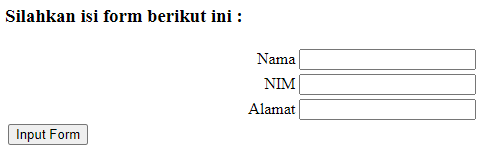

# Lab9web
## Pratikum 9 dan 10
untuk memenuhi tugas pemogramman web

Nama : Antini permatasari 
NIM  : 312010095 
Kelas: TI.20.B.1 

### Berikut ini adalah soal tugas praktikum 9 pertemuan 11 
 

1. Seperti biasa kita buka dulu xampp controlnya 
2. Selanjutnya buat file header.php terlebih dahulu. 
Berikut ini adalah tampilannya 
 
3. Selanjutnya kita akan buat file footer.php seperti berikut ini 
 
Berikut ini adalah tampilannya 
 
4. Selanjutnya kita akam membuat file home.php seperti berikut ini 
 
Berikut ini adalah tampilannya 
 
5. Selanjutnya kita akan membuat file about.php seperti berikut 
 
Berikut tampilannya 
 

## Jawaban
Berikut tampilan setelah diimplementasikan ke pada lab8_php_database 
 

### Berikut ini adalah tugas untuk pratikum 10 pertemuan 11 
 

1. Selanjutnya kita akan membuat file mobil.php seperti berikut ini 
 
Berikut ini adalah tampilannya 
 
2. Selanjutnya kita akan membuat file form.php seperti berikut ini 
 
3. Selanjutnya kita buat lagi file form_input.php seperti berikut ini 
 
Berikut ini tampilannya 
 

Sekian dari saya 
Terimakasih........ 

